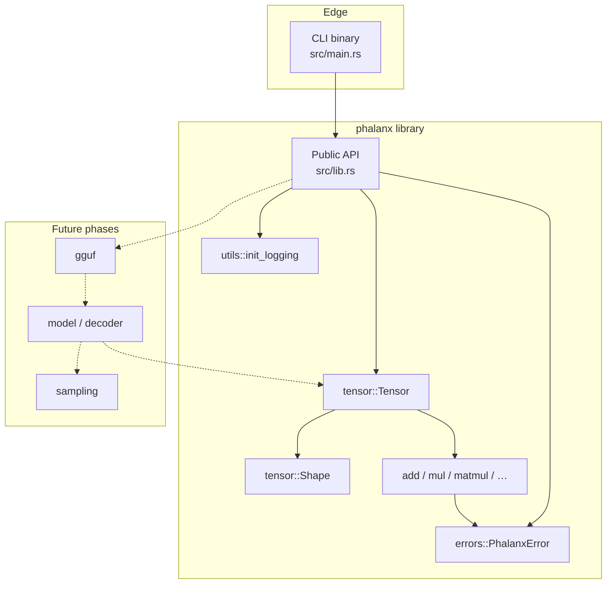
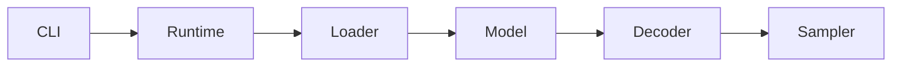

# Phalanx Runtime

A high-performance, educational inference runtime for modern decoder-only
language models — written in Rust, starting with **GGUF** weights.

Phalanx is built to be both:

1. a **production-minded systems codebase** (correctness, structure, performance), and
2. a **mini textbook** for how LLM inference actually works under the hood.

> Status: **Phase 2 complete** — contiguous `f32` tensor math + reference kernels.
> No GGUF loading or model execution yet.

---

## Project goals

Eventually Phalanx should support:

| Capability | Status |
|---|---|
| GGUF loading | Planned (Phase 3 / 5) |
| Tokenization & vocabulary | Planned (Phase 4) |
| Tensor abstraction & ops | **Phase 2** |
| Quantized tensors | Planned (Phase 5+) |
| Decoder-only transformers | Planned (Phase 6–13) |
| RMSNorm / RoPE / Attention / KV cache | Planned (Phases 8–12) |
| Sampling (greedy, temp, top-k/p, min-p) | Planned (Phase 14) |
| Streaming generation | Planned (Phase 15) |
| CLI + library API | Partial (banner CLI) |
| Logging, tests, docs | Phase 1 |
| Early microbenchmarks | **Phase 2** |
| Full benchmark / profiling suite | Planned (Phases 17–18) |

---

## Architecture (Phase 2)



Target end-state pipeline (not yet implemented):



See [docs/architecture.md](docs/architecture.md) for layout rationale and module
boundaries.

---

## Memory layout (educational)

Dense tensors are **contiguous row-major** `f32` buffers — the same convention
NumPy calls “C-order”:

```text
shape [2, 3]     strides [3, 1]

logical                          physical memory
[[a00, a01, a02],                [a00, a01, a02, a10, a11, a12]
 [a10, a11, a12]]
```

Linear offset: \(\sum_i index_i \cdot stride_i\).

**Why this matters for inference:** weights and activations are huge. A clear
layout contract lets later kernels (attention, matmul, KV cache writes) share
one addressing model. Quantized GGUF blocks (Phase 5) will sit under the same
`Tensor` / storage façade without changing shape math.

| Choice | Pros | Cons | Decision |
|---|---|---|---|
| Row-major contiguous | Familiar, teaches layout, simple kernels | Not BLAS-col-major native | **Chosen** |
| `ndarray` | Rich views / broadcast | Hides memory model | Deferred |
| Strided views now | Cheap transpose | Breaks “always contiguous” | Deferred to KV cache |

---

## Current progress

### Completed

#### Phase 1

- [x] Cargo library + binary project (`edition = "2024"`)
- [x] `rustfmt` + Clippy zero-warning policy
- [x] Typed errors (`thiserror`) + CLI context (`anyhow`)
- [x] Structured logging (`tracing`)
- [x] Foundation documentation

#### Phase 2

- [x] `tensor` module (`DType`, `Shape`, `Tensor`, `TensorError`)
- [x] Row-major strides / multi-index offset helpers
- [x] Element-wise ops, scale, matmul, transpose
- [x] Unit + integration tests
- [x] Criterion microbenchmarks (`tensor_ops`)

### Known limitations

- Only `f32` storage — no f16 / bf16 / GGUF quantized types yet.
- No broadcasting; operand shapes must match for element-wise ops.
- Matmul is a naïve \(O(n^3)\) reference kernel (no BLAS / SIMD).
- Transpose always copies to preserve contiguity.
- No GGUF parser, tokenizer, or model execution.
- CLI is a version banner only — no argument parsing yet.

### Next phase preview

**Phase 3 — GGUF file parser:** magic / version validation, metadata key-values,
tensor info records, and structured errors. This unlocks vocabulary (Phase 4)
and weight loading (Phase 5).

---

## Roadmap

| Phase | Focus |
|---|---|
| 1 | Repository foundation |
| **2** | Tensor abstraction & ops ← **you are here** |
| 3 | GGUF header / metadata parser |
| 4 | Vocabulary & tokenizer |
| 5 | Tensor / weight loading (+ mmap, quant metadata) |
| 6 | Model config (Llama-style) |
| 7–13 | Embeddings → RoPE → RMSNorm → FFN → Attention → KV cache → Decoder |
| 14–16 | Sampling → streaming generation → full CLI |
| 17–20 | Profiling → benchmarks → examples → docs polish |

Full phase definitions live in [`AGENTS.md`](AGENTS.md).

---

## Example usage

### Run the CLI

```bash
cargo run
```

Optional logging:

```bash
RUST_LOG=phalanx=debug cargo run
```

### Tensor API

```rust
use phalanx::{Shape, Tensor};

fn demo() -> phalanx::Result<()> {
    let a = Tensor::from_vec(vec![1.0, 2.0, 3.0, 4.0], Shape::new([2, 2])?)?;
    let b = Tensor::from_vec(vec![5.0, 6.0, 7.0, 8.0], Shape::new([2, 2])?)?;
    let c = a.matmul(&b)?;
    assert_eq!(c.as_slice(), &[19.0, 22.0, 43.0, 50.0]);
    Ok(())
}
```

### Benchmarks

```bash
cargo bench --bench tensor_ops
```

---

## Development instructions

### Prerequisites

- Rust **1.85+** (stable), matching `rust-version` in `Cargo.toml`
- `cargo`, `rustfmt`, `clippy` (via `rustup component add rustfmt clippy`)

### Build / test / lint / bench

```bash
cargo fmt --check
cargo test
cargo lint          # alias → clippy -D warnings
cargo bench --bench tensor_ops
cargo build --release
```

### Project layout (Phase 2)

```text
phalanx/
├── src/
│   ├── lib.rs           # library root & public re-exports
│   ├── main.rs          # thin CLI entrypoint
│   ├── errors/          # typed PhalanxError
│   ├── tensor/          # shape, dtype, storage, ops
│   └── utils/           # logging bootstrap
├── benches/             # Criterion microbenchmarks
├── tests/               # crate-boundary smoke tests
├── docs/                # architecture & implementation notes
├── assets/              # reserved for fixtures / diagrams (no weights)
├── examples/            # reserved for Phase 19
├── AGENTS.md            # engineering protocol & phase roadmap
├── README.md
├── CHANGELOG.md
└── LICENSE
```

---

## Implementation notes (summary)

| Topic | Choice | Why |
|---|---|---|
| Library errors | `thiserror` → `PhalanxError` | Matchable API for embedders |
| CLI errors | `anyhow` | Context at the process edge |
| Logging | `tracing` | Future load/prefill/decode spans |
| Tensor storage | Owned contiguous `Vec<f32>` | Teach layout; keep invariants simple |
| Matmul | Naïve reference kernel | Correctness oracle before optimization |

More detail: [docs/implementation-notes.md](docs/implementation-notes.md).

---

## Educational preview (future README chapters)

As phases land, this README will expand into explanations of:

- Why GGUF exists and how its container is laid out
- Why quantization matters for local inference
- How decoder-only transformers execute token-by-token
- How KV cache turns \(O(n^2)\) decode into \(O(n)\) per step
- The full execution pipeline beyond dense matmul
- Performance considerations (threading, SIMD, flash-attention class kernels)

---

## References

- [Attention Is All You Need](https://arxiv.org/abs/1706.03762)
- [LLaMA: Open and Efficient Foundation Language Models](https://arxiv.org/abs/2302.13971)
- [RoFormer (RoPE)](https://arxiv.org/abs/2104.09864)
- [GGUF specification](https://github.com/ggerganov/ggml/blob/master/docs/gguf.md) (via ggml / llama.cpp)
- [llama.cpp](https://github.com/ggerganov/llama.cpp)
- [FlashAttention](https://arxiv.org/abs/2205.14135)
- [Hugging Face Transformers](https://huggingface.co/docs/transformers)
- Golub & Van Loan, *Matrix Computations*

---

## License

MIT — see [LICENSE](LICENSE).
