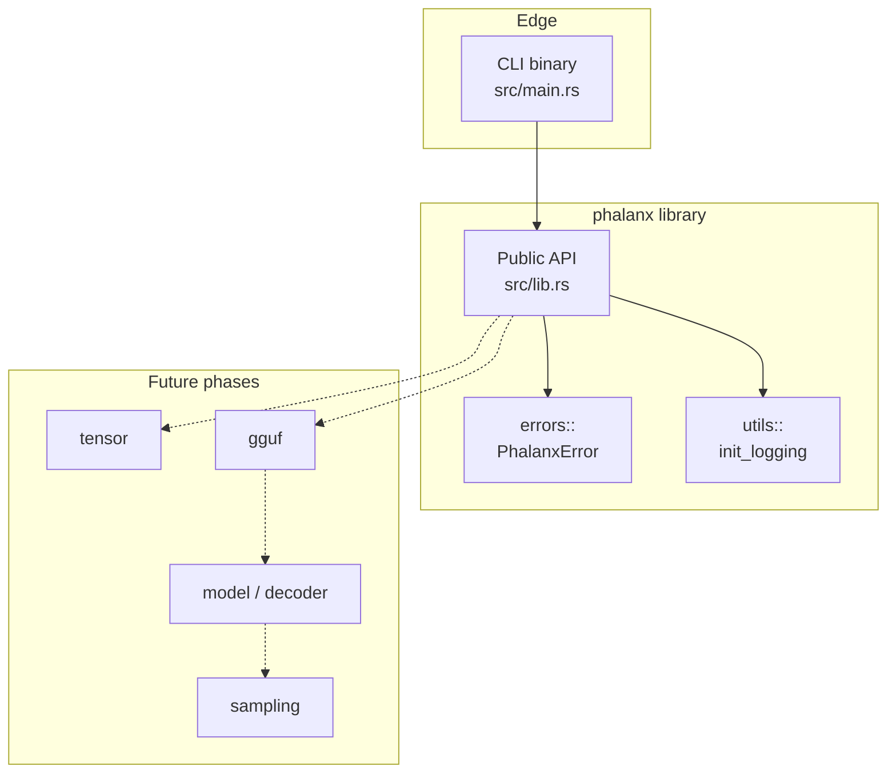
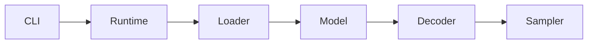

# Phalanx Runtime

A high-performance, educational inference runtime for modern decoder-only
language models — written in Rust, starting with **GGUF** weights.

Phalanx is built to be both:

1. a **production-minded systems codebase** (correctness, structure, performance), and
2. a **mini textbook** for how LLM inference actually works under the hood.

> Status: **Phase 1 complete** — repository foundation. No model execution yet.

---

## Project goals

Eventually Phalanx should support:

| Capability | Status |
|---|---|
| GGUF loading | Planned (Phase 3 / 5) |
| Tokenization & vocabulary | Planned (Phase 4) |
| Tensor abstraction & ops | Planned (Phase 2) |
| Quantized tensors | Planned (Phase 5+) |
| Decoder-only transformers | Planned (Phase 6–13) |
| RMSNorm / RoPE / Attention / KV cache | Planned (Phases 8–12) |
| Sampling (greedy, temp, top-k/p, min-p) | Planned (Phase 14) |
| Streaming generation | Planned (Phase 15) |
| CLI + library API | Partial (Phase 1 banner CLI) |
| Logging, tests, docs | **Phase 1** |
| Benchmarking & profiling | Planned (Phases 17–18) |

---

## Architecture (Phase 1)

Phase 1 intentionally keeps the graph small. Domain subsystems appear only
when their phase lands — empty folders are avoided on purpose.



Target end-state pipeline (not yet implemented):



See [docs/architecture.md](docs/architecture.md) for rationale and module
boundaries.

---

## Current progress

### Completed (Phase 1)

- [x] Cargo library + binary project (`edition = "2024"`)
- [x] Folder structure for foundation modules only
- [x] `rustfmt` + Clippy configuration (zero-warning policy)
- [x] Typed errors (`thiserror`) + CLI context (`anyhow`)
- [x] Structured logging (`tracing`)
- [x] README, changelog, license, architecture & implementation notes
- [x] Smoke / unit tests

### Known limitations

- No tensor math, GGUF parser, tokenizer, or model execution.
- CLI is a version banner only — no argument parsing yet.
- Logging installs a process-global subscriber (fine for a binary; tests must
  avoid double-init).
- Single crate today; a workspace split is deferred until module weight justifies it.

### Next phase preview

**Phase 2 — Math foundation:** tensor abstraction, memory layout, basic ops,
unit tests, and early benchmarks. This unblocks GGUF weight materialization
and every subsequent layer kernel.

---

## Roadmap

| Phase | Focus |
|---|---|
| **1** | Repository foundation ← **you are here** |
| 2 | Tensor abstraction & ops |
| 3 | GGUF header / metadata parser |
| 4 | Vocabulary & tokenizer |
| 5 | Tensor / weight loading (+ mmap, quant metadata) |
| 6 | Model config (Llama-style) |
| 7–13 | Embeddings → RoPE → RMSNorm → FFN → Attention → KV cache → Decoder |
| 14–16 | Sampling → streaming generation → full CLI |
| 17–20 | Profiling → benchmarks → examples → docs polish |

Full phase definitions live in [`AGENTS.md`](AGENTS.md).

---

## Example usage

### Run the Phase 1 CLI

```bash
cargo run
```

Optional logging:

```bash
RUST_LOG=phalanx=debug cargo run
```

### Use the library API

```rust
use phalanx::{LogConfig, PhalanxError, init_logging};

fn setup() -> Result<(), PhalanxError> {
    init_logging(&LogConfig::default())?;
    Ok(())
}
```

---

## Development instructions

### Prerequisites

- Rust **1.85+** (stable), matching `rust-version` in `Cargo.toml`
- `cargo`, `rustfmt`, `clippy` (via `rustup component add rustfmt clippy`)

### Build / test / lint

```bash
cargo fmt --check
cargo test
cargo lint          # alias → clippy -D warnings
cargo build --release
```

### Project layout (Phase 1)

```text
phalanx/
├── src/
│   ├── lib.rs           # library root & public re-exports
│   ├── main.rs          # thin CLI entrypoint
│   ├── errors/          # typed PhalanxError
│   └── utils/           # logging bootstrap
├── tests/               # crate-boundary smoke tests
├── docs/                # architecture & implementation notes
├── assets/              # reserved for fixtures / diagrams (no weights)
├── examples/            # reserved for Phase 19
├── AGENTS.md            # engineering protocol & phase roadmap
├── README.md
├── CHANGELOG.md
└── LICENSE
```

---

## Implementation notes (Phase 1)

### Error handling split

| Layer | Crate | Why |
|---|---|---|
| Library | `thiserror` → `PhalanxError` | Matchable, stable API for embedders |
| Binary / examples | `anyhow` | Context chaining at the process edge |

### Logging choice

`tracing` over `log` + `env_logger` because inference naturally maps to
**spans** (load, prefill, decode step). Paying the dependency cost now avoids
a painful migration once kernels exist.

### No premature modules

`tensor/`, `gguf/`, `attention/`, etc. are **not** created empty. AGENTS.md
allows those paths when needed; Phase 1 only creates folders that contain
real code.

More detail: [docs/implementation-notes.md](docs/implementation-notes.md).

---

## Educational preview (future README chapters)

As phases land, this README will expand into explanations of:

- Why GGUF exists and how its container is laid out
- Why quantization matters for local inference
- How decoder-only transformers execute token-by-token
- How KV cache turns \(O(n^2)\) decode into \(O(n)\) per step
- Memory layout & the execution pipeline
- Performance considerations (threading, SIMD, flash-attention class kernels)

---

## References

- [Attention Is All You Need](https://arxiv.org/abs/1706.03762)
- [LLaMA: Open and Efficient Foundation Language Models](https://arxiv.org/abs/2302.13971)
- [RoFormer (RoPE)](https://arxiv.org/abs/2104.09864)
- [GGUF specification](https://github.com/ggerganov/ggml/blob/master/docs/gguf.md) (via ggml / llama.cpp)
- [llama.cpp](https://github.com/ggerganov/llama.cpp)
- [FlashAttention](https://arxiv.org/abs/2205.14135)
- [Hugging Face Transformers](https://huggingface.co/docs/transformers)

---

## License

MIT — see [LICENSE](LICENSE).
