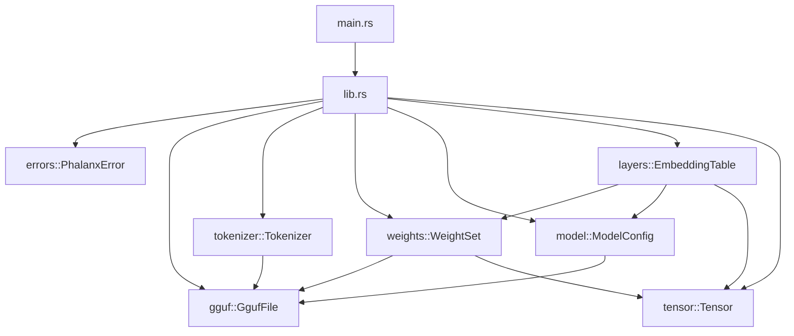
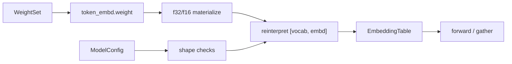

# Architecture — Phase 7

This document tracks architectural intent as Phalanx grows. Update it every
phase; the README embeds a summary diagram for quick reading.

## Goals

- **Correctness first** — wrong logits are worse than slow logits.
- **Readable systems code** — senior engineers should navigate without tribal knowledge.
- **Incremental completeness** — each phase ships a compiling, tested slice.
- **Educational clarity** — diagrams and notes explain *why*, not only *what*.

## Phase 7 component map

### Responsibilities

| Component | Responsibility | Non-goals (Phase 7) |
|---|---|---|
| `gguf` | Parse directory / metadata | Own the byte map |
| `weights` | mmap, bounds check, dense materialize | Full Q4_K dequant kernels |
| `tokenizer` | Vocab encode/decode | Chat templates |
| `model` | Architecture + validated hparams | Execute layers |
| `layers` | Embedding gather (more kernels later) | RoPE / attention / FFN |
| `tensor` | Contiguous f32 math | On-disk layout |

## Embedding load pipeline

## Boundary rules

1. **Library never depends on CLI concerns.**
2. **Typed errors stay in the library.**
3. **No empty domain modules.**
4. **`unsafe` only in `weights::storage`** for `memmap2::map`, with safety docs.
5. **Tokenizer reads only metadata** — weights module owns file bytes.
6. **Quantized payloads stay as `&[u8]`** until a kernel needs dequant.
7. **Layers read shapes from `ModelConfig`**, not raw metadata maps.
8. **ggml dimension order is reinterpreted explicitly** at layer boundaries.

## Module ownership

| Module | Owns | Introduced |
|---|---|---|
| `tensor` | Contiguous buffers, shapes, ops | Phase 2 |
| `gguf` | Header, metadata, tensor info | Phase 3 |
| `tokenizer` | Vocab, specials, encode/decode | Phase 4 |
| `weights` | mmap, quant meta, materialize | Phase 5 |
| `model` | Architecture + hyperparameters | Phase 6 |
| `layers` | Embedding (+ future kernels) | **Phase 7** |

## Tradeoffs recorded

### Reinterpret vs transpose-copy

| Option | Pros | Cons |
|---|---|---|
| **Reinterpret `[vocab, embd]` (chosen)** | Zero copy; matches ggml bytes | Callers must understand ggml order |
| Explicit transpose into new buffer | “Obvious” PyTorch layout | Wasteful bandwidth on huge vocabs |

### `layers` module vs stuffing into `model`

| Option | Pros | Cons |
|---|---|---|
| **`layers` (chosen)** | Room for RoPE / attn / FFN | Extra module |
| Everything under `model` | Fewer top-level mods | Mixes hparams with kernels |

## Evolution policy

When a phase adds a subsystem:

1. Add the module with real types and tests.
2. Update Mermaid diagrams here and in the README.
3. Record the tradeoff that drove the design.
4. Extend `PhalanxError` with a typed nested error.
