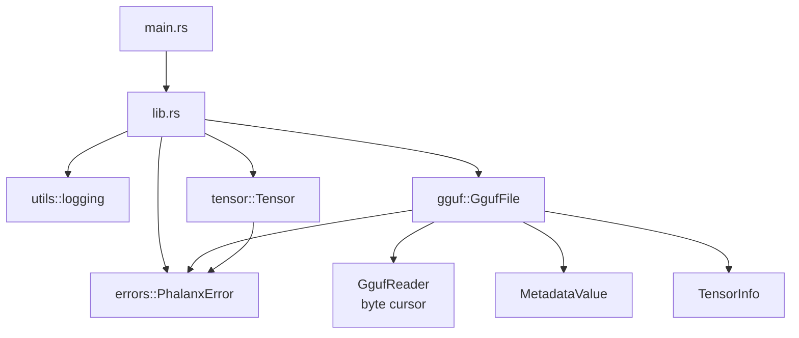
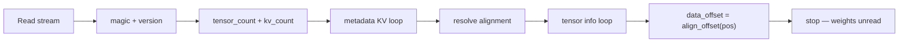

# Architecture — Phase 3

This document tracks architectural intent as Phalanx grows. Update it every
phase; the README embeds a summary diagram for quick reading.

## Goals

- **Correctness first** — wrong logits are worse than slow logits.
- **Readable systems code** — senior engineers should navigate without tribal knowledge.
- **Incremental completeness** — each phase ships a compiling, tested slice.
- **Educational clarity** — diagrams and notes explain *why*, not only *what*.

## Phase 3 component map

### Responsibilities

| Component | Responsibility | Non-goals (Phase 3) |
|---|---|---|
| `main.rs` | Process entry, banner | Path inspect CLI |
| `tensor` | Contiguous f32 math | Quantized storage |
| `gguf` | Parse header, KV metadata, tensor directory | Weight `mmap` / dequant |
| `errors` | Nest `GgufError` / `TensorError` | Exit-code mapping |

## GGUF parse pipeline

## Boundary rules

1. **Library never depends on CLI concerns.**
2. **Typed errors stay in the library** — `anyhow` only at the process edge.
3. **No empty domain modules.**
4. **`unsafe` forbidden** until reviewed mmap/SIMD.
5. **Tensors stay contiguous** in the runtime math layer.
6. **GGUF parse must not load `tensor_data`** until Phase 5.

## Module ownership

| Module | Owns | Introduced |
|---|---|---|
| `tensor` | Contiguous buffers, dtype, shapes, ops | Phase 2 |
| `gguf` | Header, metadata, tensor info, alignment | **Phase 3** |
| `tokenizer` | Vocab, encode/decode | Phase 4 |
| `model` | Config + weight handles | Phase 6 |
| `attention` / `kv_cache` | Decode-critical path | Phases 11–12 |
| `sampling` | Logits → token | Phase 14 |
| `runtime` | Orchestration / streaming | Phases 13–15 |
| `cli` | User-facing commands | Phase 16 |

## Tradeoffs recorded

### Streaming `Read` vs full buffer vs mmap-now

| Option | Pros | Cons |
|---|---|---|
| **Streaming `Read` (chosen)** | Multi-GB safe; no `unsafe` | Manual endian helpers |
| Slurp `Vec<u8>` | Simple tests | Wasteful for real models |
| `mmap` in Phase 3 | Fast inspect of weights too | Premature `unsafe` / platform code |

### Hand-rolled parser vs crates.io `gguf`

| Option | Pros | Cons |
|---|---|---|
| **Hand-rolled (chosen)** | Educational; exact error surface | We maintain format edge cases |
| External crate | Faster to “just load” | Opaque to readers of this repo |

## Evolution policy

When a phase adds a subsystem:

1. Add the module with real types and tests.
2. Update Mermaid diagrams here and in the README.
3. Record the tradeoff that drove the design.
4. Extend `PhalanxError` with a typed nested error.
