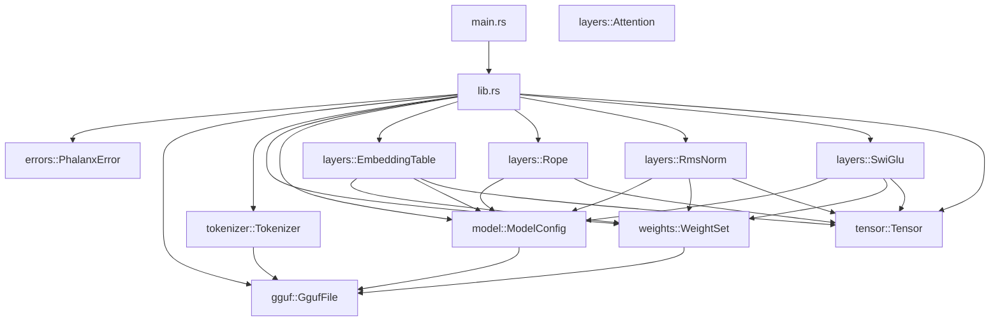
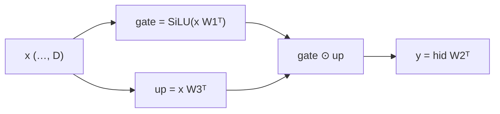

# Architecture — Phase 11

This document tracks architectural intent as Phalanx grows. Update it every
phase; the README embeds a summary diagram for quick reading.

## Goals

- **Correctness first** — wrong logits are worse than slow logits.
- **Readable systems code** — senior engineers should navigate without tribal knowledge.
- **Incremental completeness** — each phase ships a compiling, tested slice.
- **Educational clarity** — diagrams and notes explain *why*, not only *what*.
- **Odyssey parity** — Rule 6: claim Spec compliance only after `validate_*` PASSes.

## Phase 11 component map

### Responsibilities

| Component | Responsibility | Non-goals (Phase 11) |
|---|---|---|
| `layers::SwiGlu` | Gated FFN forward | Residuals / decoder |
| `layers::Attention` | Causal GQA/MHA + optional RoPE | KV cache / FlashAttention |
| `layers::RmsNorm` | γ ⊙ x / RMS(x) | Residual block wiring |
| `layers::Rope` | Cos/sin cache + Q/K rotate | Standalone score kernel |
| `layers::EmbeddingTable` | Token gather | Positions |
| `weights` | mmap / materialize | Dequant kernels |

## SwiGLU pipeline

## Boundary rules

1. **Library never depends on CLI concerns.**
2. **Typed errors stay in the library.**
3. **No empty domain modules.**
4. **`unsafe` only in `weights::storage`** for `memmap2::map`, with safety docs.
5. **Tokenizer reads only metadata** — weights module owns file bytes.
6. **Quantized payloads stay as `&[u8]`** until a kernel needs dequant.
7. **Layers read shapes from `ModelConfig`**, not raw metadata maps.
8. **ggml dimension order is reinterpreted explicitly** at layer boundaries.
9. **RoPE does not touch V** — only Q/K (applied inside `Attention::forward`).
10. **RMSNorm is not LayerNorm** — no mean centering.
11. **SwiGLU is not GeLU MLP** — Spec activation key must remain `swiglu`.
12. **Cross-impl validators** are part of the public contract.

## Module ownership

| Module | Owns | Introduced |
|---|---|---|
| `tensor` | Contiguous buffers, shapes, ops | Phase 2 |
| `gguf` | Header, metadata, tensor info | Phase 3 |
| `tokenizer` | Vocab, specials, encode/decode | Phase 4 |
| `weights` | mmap, quant meta, materialize | Phase 5 |
| `model` | Architecture + hyperparameters | Phase 6 |
| `layers` | Embedding + RoPE + RMSNorm + SwiGLU | Phase 7–**10** |

## Tradeoffs recorded

### Float64 matmul accumulators

| Option | Pros | Cons |
|---|---|---|
| **f64 Σ then f32 store (chosen)** | Closer to PyTorch; Spec parity | Slightly slower reference kernel |
| Pure f32 ijk | Faster | Larger max abs error vs Odyssey |

### SwiGLU abs tolerance `1e-3`

Documented component exception to the default `1e-6` (mean error remains ≪ `1e-6`).

## Evolution policy

When a phase adds a subsystem:

1. Add the module with real types and tests.
2. Update Mermaid diagrams here and in the README.
3. Record the tradeoff that drove the design.
4. Extend `PhalanxError` with a typed nested error.
5. Add `validate_<component>` and land a PASS report before flipping Spec compliance.
