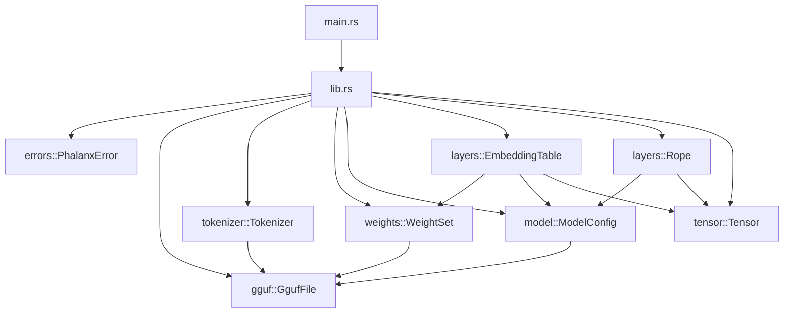
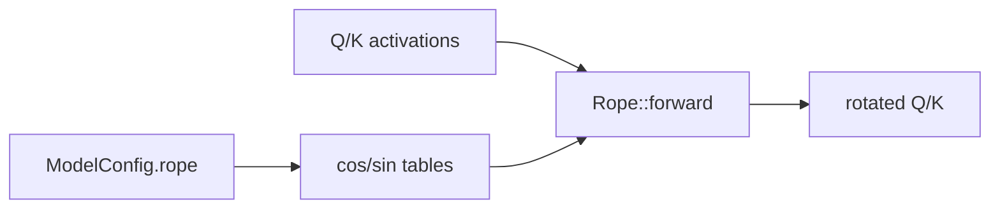

# Architecture — Phase 8

This document tracks architectural intent as Phalanx grows. Update it every
phase; the README embeds a summary diagram for quick reading.

## Goals

- **Correctness first** — wrong logits are worse than slow logits.
- **Readable systems code** — senior engineers should navigate without tribal knowledge.
- **Incremental completeness** — each phase ships a compiling, tested slice.
- **Educational clarity** — diagrams and notes explain *why*, not only *what*.

## Phase 8 component map

### Responsibilities

| Component | Responsibility | Non-goals (Phase 8) |
|---|---|---|
| `model` | Hparams including `rope.*` | Execute rotations |
| `layers::Rope` | Cos/sin cache + Q/K rotate | Attention scores |
| `layers::EmbeddingTable` | Token gather | Positions |
| `weights` | mmap / materialize | Dequant kernels |

## RoPE pipeline

## Boundary rules

1. **Library never depends on CLI concerns.**
2. **Typed errors stay in the library.**
3. **No empty domain modules.**
4. **`unsafe` only in `weights::storage`** for `memmap2::map`, with safety docs.
5. **Tokenizer reads only metadata** — weights module owns file bytes.
6. **Quantized payloads stay as `&[u8]`** until a kernel needs dequant.
7. **Layers read shapes from `ModelConfig`**, not raw metadata maps.
8. **ggml dimension order is reinterpreted explicitly** at layer boundaries.
9. **RoPE does not touch V** — only Q/K (attention Phase 11).

## Module ownership

| Module | Owns | Introduced |
|---|---|---|
| `tensor` | Contiguous buffers, shapes, ops | Phase 2 |
| `gguf` | Header, metadata, tensor info | Phase 3 |
| `tokenizer` | Vocab, specials, encode/decode | Phase 4 |
| `weights` | mmap, quant meta, materialize | Phase 5 |
| `model` | Architecture + hyperparameters | Phase 6 |
| `layers` | Embedding + RoPE (+ future kernels) | Phase 7–**8** |

## Tradeoffs recorded

### Precompute cos/sin vs on-the-fly

| Option | Pros | Cons |
|---|---|---|
| **Precompute to `context_length` (chosen)** | Fast decode; auditable tables | Memory ∝ ctx × pairs |
| Compute `sin`/`cos` per call | Tiny footprint | Repeated transcendentals |

### Linear-only scaling in Phase 8

| Option | Pros | Cons |
|---|---|---|
| **Linear only (chosen)** | Matches common GGUF exports; correct math | YaRN/NTK rejected |
| Stub all scaling types as no-ops | Broader open | Silently wrong long-context |

## Evolution policy

When a phase adds a subsystem:

1. Add the module with real types and tests.
2. Update Mermaid diagrams here and in the README.
3. Record the tradeoff that drove the design.
4. Extend `PhalanxError` with a typed nested error.
