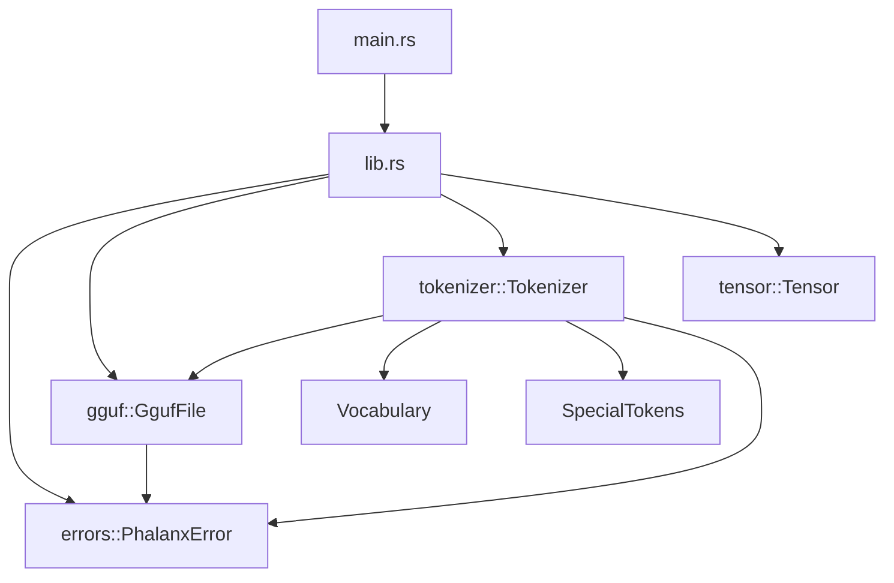
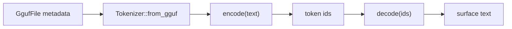

# Architecture — Phase 4

This document tracks architectural intent as Phalanx grows. Update it every
phase; the README embeds a summary diagram for quick reading.

## Goals

- **Correctness first** — wrong logits are worse than slow logits.
- **Readable systems code** — senior engineers should navigate without tribal knowledge.
- **Incremental completeness** — each phase ships a compiling, tested slice.
- **Educational clarity** — diagrams and notes explain *why*, not only *what*.

## Phase 4 component map

### Responsibilities

| Component | Responsibility | Non-goals (Phase 4) |
|---|---|---|
| `gguf` | Parse container metadata | Weight bytes |
| `tokenizer` | Vocab load, specials, encode/decode | Chat templates / Jinja |
| `tensor` | Contiguous f32 math | Quantized storage |
| `main` | Banner | Inspect CLI |

## Token path

## Boundary rules

1. **Library never depends on CLI concerns.**
2. **Typed errors stay in the library.**
3. **No empty domain modules.**
4. **`unsafe` forbidden** until reviewed mmap/SIMD.
5. **GGUF parse must not load `tensor_data`** until Phase 5.
6. **Tokenizer reads only metadata** — never opens weight blobs.

## Module ownership

| Module | Owns | Introduced |
|---|---|---|
| `tensor` | Contiguous buffers, shapes, ops | Phase 2 |
| `gguf` | Header, metadata, tensor info | Phase 3 |
| `tokenizer` | Vocab, specials, encode/decode | **Phase 4** |
| `model` | Config + weight handles | Phase 6 |

## Tradeoffs recorded

### Hand-rolled tokenizer vs `tokenizers` crate

| Option | Pros | Cons |
|---|---|---|
| **Hand-rolled (chosen)** | Auditable; uses GGUF tables directly | Edge-case drift vs HF |
| Hugging Face `tokenizers` | High parity | Heavy; bypasses GGUF education |

## Evolution policy

When a phase adds a subsystem:

1. Add the module with real types and tests.
2. Update Mermaid diagrams here and in the README.
3. Record the tradeoff that drove the design.
4. Extend `PhalanxError` with a typed nested error.
