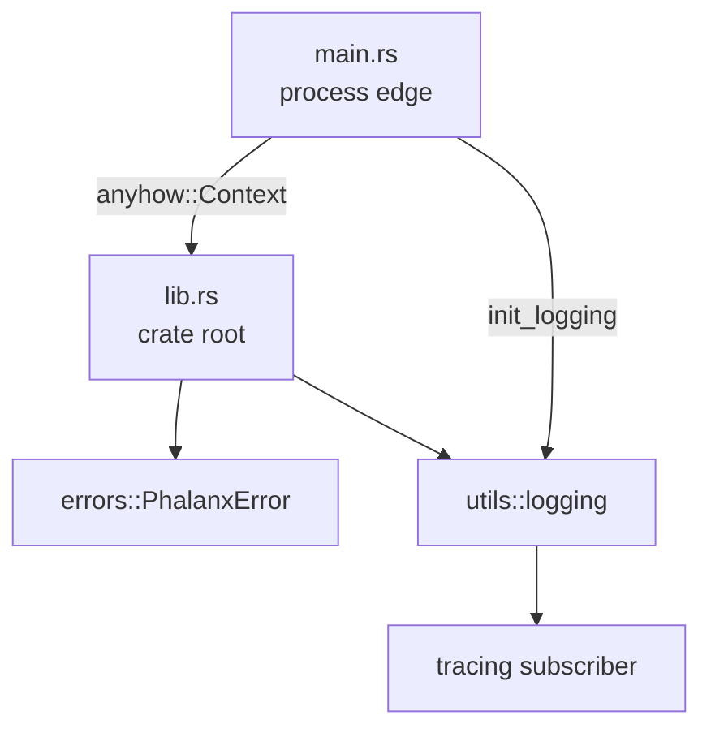
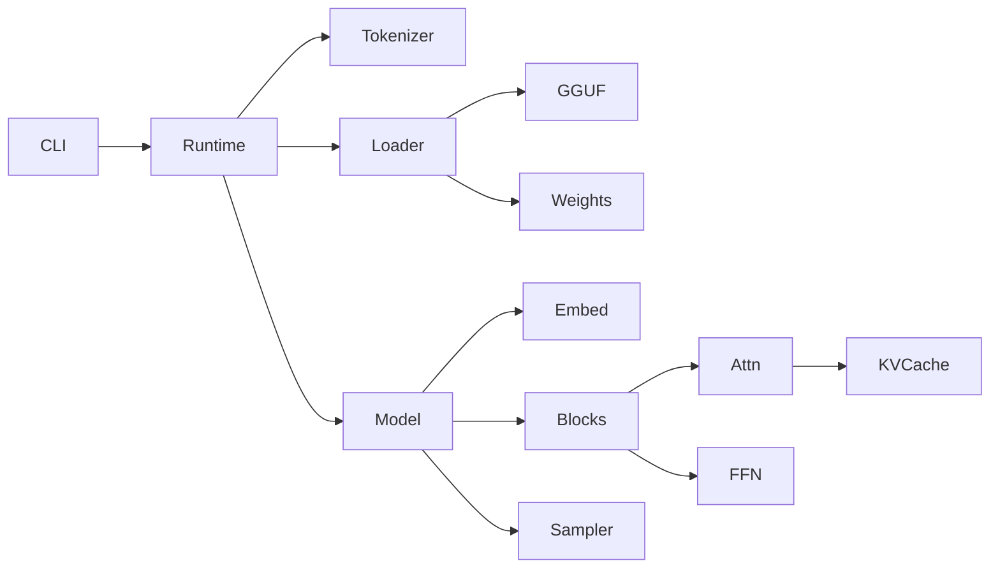

# Architecture — Phase 1

This document tracks architectural intent as Phalanx grows. Update it every
phase; the README embeds a summary diagram for quick reading.

## Goals

- **Correctness first** — wrong logits are worse than slow logits.
- **Readable systems code** — senior engineers should navigate without tribal knowledge.
- **Incremental completeness** — each phase ships a compiling, tested slice.
- **Educational clarity** — diagrams and notes explain *why*, not only *what*.

## Phase 1 component map

### Responsibilities

| Component | Responsibility | Non-goals (Phase 1) |
|---|---|---|
| `main.rs` | Process entry, logging init, banner | Arg parsing, generation loop |
| `lib.rs` | Public surface, version constants | Domain algorithms |
| `errors` | Typed library failures | CLI exit-code mapping |
| `utils::logging` | Global subscriber bootstrap | Metrics / profiling exporters |

## Boundary rules

1. **Library never depends on CLI concerns** — no `clap` / argv parsing inside `lib`.
2. **Typed errors stay in the library** — `anyhow` is for binaries and examples.
3. **No empty domain modules** — create `tensor`, `gguf`, … only with real code.
4. **`unsafe` is forbidden** until a reviewed hot path (e.g. mmap, SIMD) needs it.

## Target architecture (later phases)

### Planned module ownership

| Module | Owns | Introduced |
|---|---|---|
| `tensor` | Contiguous buffers, dtype, views, ops | Phase 2 |
| `gguf` | Header, metadata, tensor info | Phase 3 |
| `tokenizer` | Vocab, encode/decode | Phase 4 |
| `model` | Config + weight handles | Phase 6 |
| `attention` / `kv_cache` | Decode-critical path | Phases 11–12 |
| `sampling` | Logits → token | Phase 14 |
| `runtime` | Orchestration / streaming | Phases 13–15 |
| `cli` | User-facing commands | Phase 16 |

## Tradeoffs recorded

### Single crate vs workspace

| Option | Pros | Cons |
|---|---|---|
| **Single crate (chosen)** | Simple paths, one `Cargo.toml`, fast iteration | All code shares dependency set |
| Cargo workspace | Cleaner publish boundaries | Overhead too early for ~few modules |

**Decision:** stay single-crate until compile times or dependency isolation hurt.

### Error & logging choices

Documented in [implementation-notes.md](implementation-notes.md).

## Evolution policy

When a phase adds a subsystem:

1. Add the module with real types and tests.
2. Update the Mermaid diagrams here and in the README.
3. Record the tradeoff that drove the design.
4. Extend `PhalanxError` with a typed variant (or nested error) — avoid stringly errors for expected failures.
