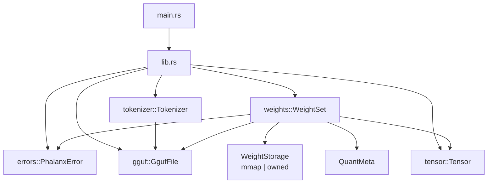
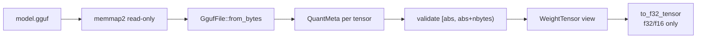

# Architecture — Phase 5

This document tracks architectural intent as Phalanx grows. Update it every
phase; the README embeds a summary diagram for quick reading.

## Goals

- **Correctness first** — wrong logits are worse than slow logits.
- **Readable systems code** — senior engineers should navigate without tribal knowledge.
- **Incremental completeness** — each phase ships a compiling, tested slice.
- **Educational clarity** — diagrams and notes explain *why*, not only *what*.

## Phase 5 component map

### Responsibilities

| Component | Responsibility | Non-goals (Phase 5) |
|---|---|---|
| `gguf` | Parse directory / metadata | Own the byte map |
| `weights` | mmap, bounds check, dense materialize | Full Q4_K dequant kernels |
| `tokenizer` | Vocab encode/decode | Chat templates |
| `tensor` | Contiguous f32 math | On-disk layout |

## Weight load pipeline

## Boundary rules

1. **Library never depends on CLI concerns.**
2. **Typed errors stay in the library.**
3. **No empty domain modules.**
4. **`unsafe` only in `weights::storage`** for `memmap2::map`, with safety docs.
5. **Tokenizer reads only metadata** — weights module owns file bytes.
6. **Quantized payloads stay as `&[u8]`** until a kernel needs dequant.

## Module ownership

| Module | Owns | Introduced |
|---|---|---|
| `tensor` | Contiguous buffers, shapes, ops | Phase 2 |
| `gguf` | Header, metadata, tensor info | Phase 3 |
| `tokenizer` | Vocab, specials, encode/decode | Phase 4 |
| `weights` | mmap, quant meta, materialize | **Phase 5** |
| `model` | Config + named weight binds | Phase 6 |

## Tradeoffs recorded

### mmap vs owned copy

| Option | Pros | Cons |
|---|---|---|
| **mmap (chosen)** | Scales to large GGUF files | Reviewed `unsafe` call |
| Owned `Vec` | No `unsafe` | Impractical for big models |

### Dequant now vs later

| Option | Pros | Cons |
|---|---|---|
| **Metadata + views now (chosen)** | Unblocks config / wiring | Can't run Q4_K matmul yet |
| Full dequant in Phase 5 | Instant f32 weights | Huge scope; duplicates future kernels |

## Evolution policy

When a phase adds a subsystem:

1. Add the module with real types and tests.
2. Update Mermaid diagrams here and in the README.
3. Record the tradeoff that drove the design.
4. Extend `PhalanxError` with a typed nested error.
