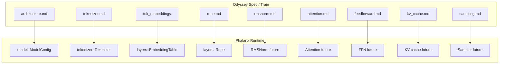
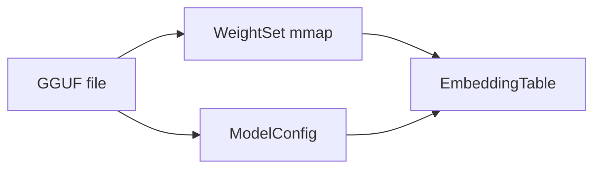

# Architecture Mapping — Odyssey ↔ Phalanx

Crosswalk between Odyssey Specification components and Phalanx Runtime modules.

Normative Spec: [`odyssey/spec/`](../../odyssey/spec/README.md) `1.0.0`.

---

## System Mapping

---

## Component Table

| Odyssey Spec | Logical weight / concept | GGUF | Phalanx today |
| --- | --- | --- | --- |
| Architecture / config | hparams | `llama.*` keys | `ModelConfig::from_gguf` |
| Tokenizer | `odyssey-bpe` | `tokenizer.ggml.*` | GGUF tokenizer only |
| Embedding | `tok_embeddings.weight` | `token_embd.weight` | `EmbeddingTable` ✓ |
| RoPE | positions on Q/K | `llama.rope.*` | `Rope` ✓ |
| RMSNorm | `*.attention_norm` / `ffn_norm` / `norm` | `blk.*.attn_norm` / `ffn_norm` / `output_norm` | `RmsNorm` ✓ |
| SwiGLU | `w1/w3/w2` | `blk.*.ffn_gate/up/down` | `SwiGlu` ✓ |
| Attention | `wq/wk/wv/wo` | `blk.*.attn_*` | Planned |
| SwiGLU | `w1/w3/w2` | `ffn_gate/up/down` | Planned |
| KV cache | runtime state | — | Planned |
| LM head | `output.weight` | `output.weight` | Planned |
| Sampler | — | — | Planned |

---

## Forward Pass Mapping

| Spec stage | Phalanx execution |
| --- | --- |
| Tokenizer encode | `Tokenizer::encode` |
| Embedding | `EmbeddingTable::forward` |
| RoPE | `Rope::forward` on Q/K |
| RMSNorm | `RmsNorm::forward` on residual stream |
| SwiGLU | `SwiGlu::forward` |
| Attn / block residuals | Not wired |
| Logits / sample | Not wired |

---

## Weight Loading Pipeline

---

## Gaps to Close (ordered)

1. Require / read `odyssey.spec.version`
2. Native load of `odyssey-bpe` artifacts (parity with Python)
3. RMSNorm → SwiGLU → Attention → KV → Decoder → Sampling
4. Golden parity tests against Odyssey tensors

---

## References

- [spec-compliance.md](spec-compliance.md)
- [compatibility.md](compatibility.md)
- [embeddings.md](embeddings.md), [rope.md](rope.md), [model.md](model.md)
