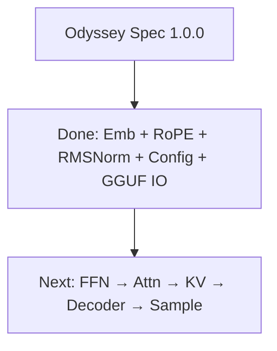

# Spec Compliance

**Runtime role:** Reference inference implementation for Odyssey  
**Target specification:** [Odyssey Spec `1.0.0`](../../odyssey/spec/README.md)  
**Declared support:** `supported_odyssey_spec = ["1.0.0"]`

This matrix is the roadmap to full Odyssey compatibility. It does **not** authorize divergence from Spec shapes or names.

---

## Compliance Matrix

| Spec area | Status | Runtime location | Notes |
| --- | --- | --- | --- |
| Architecture metadata load | ✓ Partial | `model::ModelConfig` | Llama GGUF keys; Odyssey KV not yet required |
| Tensor shape invariants | ✓ Partial | `ModelConfig::validate` | Head/GQA/RoPE checks |
| Tokenizer API parity | ✗ | `tokenizer::Tokenizer` | GGUF path only; no `odyssey-bpe` dir loader yet |
| Weight naming (GGUF map) | ✓ Partial | `token_embd` + norm γ names | Embedding + RMSNorm γ bound |
| Embedding gather | ✓ | `layers::EmbeddingTable` | Matches Spec `(V,D)` logical table |
| RoPE | ✓ | `layers::Rope` | θ, partial rotary, linear scaling; **validated vs Odyssey** |
| RMSNorm | ✓ | `layers::RmsNorm` | Spec formula; **validated vs Odyssey** (`validate_rmsnorm`) |
| SwiGLU FFN | ✓ | `layers::SwiGlu` | Spec formula; **validated vs Odyssey** (`validate_swiglu`, tol `1e-3`) |
| Attention (causal / GQA) | ✗ | — | Phase 11 |
| Residual pre-norm block | ✗ | — | Phase 13 (helpers land with decoder) |
| Final norm + LM head | ✗ | — | Phase 13 |
| KV cache | ✗ | — | Phase 12 |
| Sampling | ✗ | — | Phase 14 |
| Full decoder forward | ✗ | — | Phase 13 |
| Spec version negotiation | ✗ | — | Read `odyssey.spec.version` KV |
| Numeric parity tests vs Odyssey | ✓ Partial | `validate_rope` / `validate_rmsnorm` | Shared suite: `../validation/` |

Legend: ✓ done · ✗ not done · Partial = present but not full Spec surface.

---

## Diagram

---

## Non-Goals for This Document

- Implementing missing layers (tracked by runtime phases)
- Changing Odyssey Spec unilaterally

When a layer lands, flip its row to ✓ and link the module + doc.
