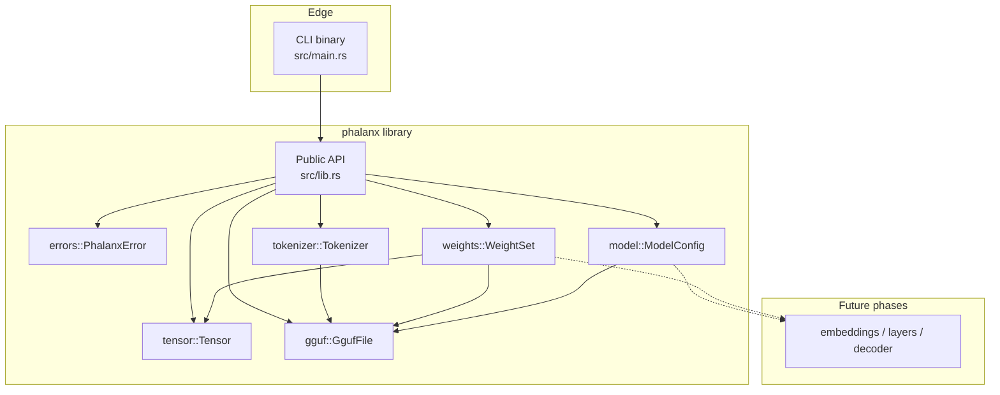

# Phalanx Runtime

A high-performance, educational inference runtime for modern decoder-only
language models — written in Rust, starting with **GGUF** weights.

Phalanx is built to be both:

1. a **production-minded systems codebase** (correctness, structure, performance), and
2. a **mini textbook** for how LLM inference actually works under the hood.

> Status: **Phase 6 complete** — Llama-style `ModelConfig` from GGUF metadata.
> Embeddings and layer kernels come next.

---

## Project goals

Eventually Phalanx should support:


| Capability                              | Status                 |
| --------------------------------------- | ---------------------- |
| GGUF header / metadata / tensor info    | Phase 3                |
| GGUF weight loading (`mmap` / quant meta) | **Phase 5**          |
| Tokenization & vocabulary               | Phase 4                |
| Tensor abstraction & ops                | Phase 2                |
| Quantized tensors (metadata / views)    | Phase 5 (dequant later) |
| Model config (Llama hparams)            | **Phase 6**            |
| Decoder-only transformers               | Planned (Phase 7–13)   |
| RMSNorm / RoPE / Attention / KV cache   | Planned (Phases 8–12)  |
| Sampling (greedy, temp, top-k/p, min-p) | Planned (Phase 14)     |
| Streaming generation                    | Planned (Phase 15)     |
| CLI + library API                       | Partial (banner CLI)   |
| Logging, tests, docs                    | Phase 1                |
| Early microbenchmarks                   | Phase 2                |
| Full benchmark / profiling suite        | Planned (Phases 17–18) |


---


## Architecture (Phase 6)



See [docs/architecture.md](docs/architecture.md), [docs/gguf.md](docs/gguf.md),
[docs/tokenizer.md](docs/tokenizer.md), [docs/weights.md](docs/weights.md),
and [docs/model.md](docs/model.md).

---


## Why GGUF exists (educational)

Training checkpoints are optimized for *training frameworks*, not local
inference: sharded files, Python pickles, and weak quantization metadata. GGUF
packs **typed metadata + a tensor directory + an** `mmap`**-friendly weight blob**
into one file so a small native runtime can load models without a Python stack.

```text
[ magic | version | counts ]
[ metadata key-value × N ]     ← architecture, hparams, tokenizer…
[ tensor info × M ]            ← name, shape, ggml_type, offset
[ padding to alignment ]
[ tensor_data … ]              ← Phase 5 maps this
```

Phase 3 parses everything **above** `tensor_data` and records `data_offset`.
Phase 5 memory-maps the file and slices each tensor using quantization metadata
(per the [GGUF spec](https://github.com/ggml-org/ggml/blob/master/docs/gguf.md)).

---


## Memory layout (tensors)

Dense runtime tensors (Phase 2) are contiguous row-major `f32` buffers.
GGUF may store quantized `ggml_type` blocks on disk. Phase 5 maps those bytes
and records block metadata; `f32`/`f16` can materialize into `Tensor` today.
Block dequant kernels arrive with later layer work.

---

## Current progress

### Completed

#### Phase 1

- [x] Cargo library + binary, lint/format, errors, logging, docs

#### Phase 2

- [x] `tensor` module, reference kernels, Criterion benches

#### Phase 3

- [x] `gguf` module: magic/version validation, metadata KV, tensor info

#### Phase 4

- [x] `tokenizer` module: vocab, specials, encode/decode

#### Phase 5

- [x] `weights` module: `WeightSet::open_mmap` / `from_bytes`
- [x] Quantization metadata (`block_size`, `type_size`) for common ggml types
- [x] Tensor payload bounds validation
- [x] Materialize dense `f32` / `f16` → `Tensor`
- [x] Reviewed `unsafe` island solely for `memmap2`

#### Phase 6

- [x] `model` module: `Architecture::Llama`, `ModelConfig::from_gguf`
- [x] Attention / RoPE / RMSNorm ε hyperparameters + GQA helpers
- [x] Structural validation (head dims, GQA ratio, RoPE parity)
- [x] Defaults for missing `head_count_kv` and `rope.freq_base`

### Known limitations

- Only `general.architecture = "llama"` is configured (others rejected).
- Config does not yet bind named weight tensors to layers.
- Quantized types are viewable as bytes but not yet dequantized to `f32`.
- Encode is a reference implementation (greedy / BPE), not guaranteed HF parity.
- Little-endian only (GGUF default).
- CLI cannot yet `inspect` a path — library API only.
- Crate `unsafe_code` is `deny` (not `forbid`); only `weights::storage` opts in.

### Next phase preview

**Phase 7 — Embedding layer:** look up token embeddings from loaded weights using
`ModelConfig` shapes.

---

## Roadmap


| Phase | Focus                                                              |
| ----- | ------------------------------------------------------------------ |
| 1     | Repository foundation                                              |
| 2     | Tensor abstraction & ops                                           |
| 3     | GGUF header / metadata parser                                      |
| 4     | Vocabulary & tokenizer                                             |
| 5     | Tensor / weight loading (+ mmap, quant metadata)                   |
| **6** | Model config (Llama-style) ← **you are here**                      |
| 7–13  | Embeddings → RoPE → RMSNorm → FFN → Attention → KV cache → Decoder |
| 14–16 | Sampling → streaming generation → full CLI                         |
| 17–20 | Profiling → benchmarks → examples → docs polish                    |


---


## Example usage


### Run the CLI

```bash
cargo run
```


### Parse GGUF + tokenize (library)

```rust
use phalanx::{EncodeOptions, GgufFile, Tokenizer};

fn prompt_ids(path: &str, text: &str) -> phalanx::Result<Vec<u32>> {
    let file = GgufFile::from_path(path)?;
    let tok = Tokenizer::from_gguf(&file)?;
    tok.encode(text, EncodeOptions::default())
}
```

### Map weights (library)

```rust
use phalanx::WeightSet;

fn load_dense(path: &str, name: &str) -> phalanx::Result<phalanx::Tensor> {
    let weights = WeightSet::open_mmap(path)?;
    weights.tensor(name)?.to_f32_tensor()
}
```

### Model config (library)

```rust
use phalanx::{GgufFile, ModelConfig};

fn load_hparams(path: &str) -> phalanx::Result<ModelConfig> {
    let file = GgufFile::from_path(path)?;
    ModelConfig::from_gguf(&file)
}
```


### Tensor API

```rust
use phalanx::{Shape, Tensor};

fn demo() -> phalanx::Result<()> {
    let a = Tensor::from_vec(vec![1.0, 2.0, 3.0, 4.0], Shape::new([2, 2])?)?;
    let b = Tensor::from_vec(vec![5.0, 6.0, 7.0, 8.0], Shape::new([2, 2])?)?;
    let c = a.matmul(&b)?;
    assert_eq!(c.as_slice(), &[19.0, 22.0, 43.0, 50.0]);
    Ok(())
}
```


### Benchmarks

```bash
cargo bench --bench tensor_ops
```

---


## Development instructions


### Prerequisites

- Rust **1.85+** (stable), matching `rust-version` in `Cargo.toml`
- `cargo`, `rustfmt`, `clippy` (via `rustup component add rustfmt clippy`)


### Build / test / lint / bench

```bash
cargo fmt --check
cargo test
cargo lint          # alias → clippy -D warnings
cargo bench --bench tensor_ops
cargo build --release
```


### Project layout (Phase 6)

```text
runtime/
├── src/
│   ├── lib.rs           # library root & public re-exports
│   ├── main.rs          # thin CLI entrypoint
│   ├── errors/          # typed PhalanxError
│   ├── tensor/          # shape, dtype, storage, ops
│   ├── gguf/            # GGUF container parser
│   ├── tokenizer/       # vocab, specials, encode/decode
│   ├── weights/         # mmap, quant metadata, materialize
│   ├── model/           # architecture + transformer config
│   └── utils/           # logging bootstrap
├── benches/             # Criterion microbenchmarks
├── tests/               # crate-boundary smoke tests
├── docs/                # architecture, GGUF, tokenizer, weights, model
├── assets/              # reserved for fixtures / diagrams (no weights)
├── examples/            # reserved for Phase 19
├── AGENTS.md
├── README.md
├── CHANGELOG.md
└── LICENSE
```

---

## Implementation notes (summary)


| Topic          | Choice                         | Why                                             |
| -------------- | ------------------------------ | ----------------------------------------------- |
| Library errors | `thiserror` → `PhalanxError`   | Matchable API for embedders                     |
| GGUF I/O       | Streaming `Read` + byte cursor | Inspect multi-GB models without loading weights |
| Weight I/O     | `memmap2` read-only map        | Open multi-GB checkpoints without copying       |
| Model config   | Llama-only validated struct    | Honest scope; layers share one hparam source    |
| Tokenizer      | Hand-rolled greedy / BPE       | Teach encode/decode; avoid heavy HF deps        |
| Tensor storage | Owned contiguous `Vec<f32>`    | Teach layout; keep invariants simple            |
| Matmul         | Naïve reference kernel         | Correctness oracle before optimization          |


More detail: [docs/implementation-notes.md](docs/implementation-notes.md).

---


## Educational preview (future README chapters)

As phases land, this README will expand into explanations of:

- How decoder-only transformers execute token-by-token
- How KV cache turns O(n^2) decode into O(n) per step
- The full execution pipeline beyond dense matmul
- Performance considerations (threading, SIMD, flash-attention class kernels)

GGUF / tokenizer / weights / model notes: [docs/gguf.md](docs/gguf.md),
[docs/tokenizer.md](docs/tokenizer.md), [docs/weights.md](docs/weights.md),
[docs/model.md](docs/model.md).

---


## References

- [GGUF specification](https://github.com/ggml-org/ggml/blob/master/docs/gguf.md)
- [llama.cpp](https://github.com/ggerganov/llama.cpp)
- [Attention Is All You Need](https://arxiv.org/abs/1706.03762)
- [LLaMA: Open and Efficient Foundation Language Models](https://arxiv.org/abs/2302.13971)
- [RoFormer (RoPE)](https://arxiv.org/abs/2104.09864)
- [FlashAttention](https://arxiv.org/abs/2205.14135)
- [Hugging Face Transformers](https://huggingface.co/docs/transformers)
- Golub & Van Loan, *Matrix Computations*

---


## License

MIT — see [LICENSE](LICENSE).